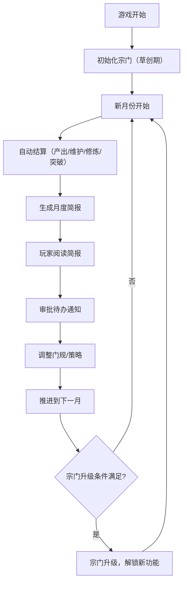
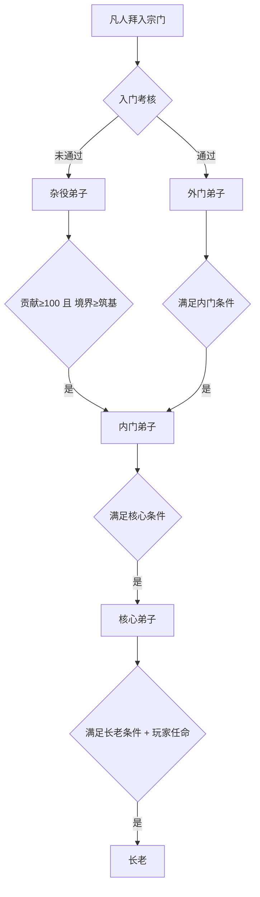

## 1. 产品概述

宗门管理游戏是一款轻松向修仙题材的策略经营游戏，玩家扮演「天道CEO」角色，通过制定门规让宗门自动运转，核心体验为宏观治理与养成乐趣。

- 核心玩法：制定规则 → 观察自动运转 → 月度决策 → 宗门壮大
- 目标用户：喜欢放置类、经营类、修仙题材游戏的玩家
- 核心价值：低操作成本（每月≤2分钟）、高成就感、策略深度

## 2. 核心功能

### 2.1 用户角色

| 角色 | 进入方式 | 核心权限 |
|------|----------|----------|
| 掌门（玩家） | 游戏开始即扮演 | 制定门规、审批通知、任免长老、战略调整 |

### 2.2 功能模块

1. **主界面**：宗门俯瞰图、顶部状态栏、侧边导航、月度简报
2. **弟子系统**：弟子列表、弟子详情、晋升路径、隐藏天赋
3. **经济系统**：灵石收支、贡献点循环、建筑维护费
4. **建筑系统**：树状解锁、建筑升级、维护费管理
5. **门规系统**：自动晋升规则、资源分配策略、危机应对预案
6. **丹药系统**：丹药炼制、自动分配、库存管理
7. **长老系统**：长老任命、堂口加成、专精加成

### 2.3 页面详情

| 页面名称 | 模块名称 | 功能描述 |
|-----------|-------------|---------------------|
| 主界面 | 宗门俯瞰图 | 展示宗门建筑布局、灵气光晕、弟子人流动态 |
| 主界面 | 顶部状态栏 | 显示宗门等级、声望、灵石、贡献点、当前年月 |
| 主界面 | 侧边导航 | 切换各系统面板（弟子/建筑/丹药/门规/长老） |
| 主界面 | 月度简报弹窗 | 每月结算时展示收支、事件、晋升、突破汇总 |
| 弟子面板 | 弟子列表 | 按身份/职能筛选，展示弟子头像、境界、贡献点 |
| 弟子面板 | 弟子详情 | 显示弟子属性、天赋描述、修炼进度、历史记录 |
| 弟子面板 | 晋升管理 | 查看晋升队列、手动调整晋升条件 |
| 建筑面板 | 建筑树 | 树状展示建筑解锁路径、等级、状态 |
| 建筑面板 | 建筑详情 | 显示产出、维护费、升级条件、管辖长老 |
| 经济面板 | 收支明细 | 月度收入/支出列表、趋势图、破产预警 |
| 门规面板 | 规则配置 | 自定义晋升条件、资源分配策略、危机预案开关 |
| 丹药面板 | 炼丹房 | 批量炼制、丹方解锁、自动续炼设置 |
| 长老面板 | 长老列表 | 已任命长老、管辖堂口、加成数值 |

## 3. 核心流程

玩家每月操作流程：阅读月度简报 → 审批待办通知 → 调整门规/策略 → 推进到下一月

弟子晋升自动流程：

## 4. 用户界面设计

### 4.1 设计风格

- **主色调**：深青黛色（#1a2e2a）为底，鎏金色（#d4a857）为强调，玉石白（#e8e4d9）为文字
- **辅助色**：灵气紫（#9b7ed4）、灵草绿（#5a8a6a）、丹火红（#c26a4a）
- **按钮风格**：仿古卷轴按钮，圆角8px，悬浮时鎏金边发光
- **字体**：
  - 标题：霞鹜文楷（古风书法字体）
  - 正文：思源宋体（典雅易读）
- **布局风格**：左右分栏，左侧为古风卷轴式导航，右侧为水墨风内容区
- **图标风格**：线性古风图标，配合鎏金色描边
- **背景质感**：宣纸纹理底 + 淡墨山水装饰 + 灵气光晕动效

### 4.2 页面设计概览

| 页面名称 | 模块名称 | UI元素 |
|-----------|-------------|-------------|
| 主界面 | 宗门俯瞰图 | 等距视角建筑、流动灵气光晕、弟子小人走动、建筑升级金光特效 |
| 主界面 | 顶部状态栏 | 横条卷轴样式、图标+数值、悬浮显示详情 |
| 主界面 | 侧边导航 | 竖排卷轴、图标+文字、选中项鎏金高亮 |
| 月度简报 | 弹窗 | 古卷轴展开动画、分栏展示、盖章式确认按钮 |
| 弟子列表 | 卡片网格 | 弟子头像框、境界徽章、贡献点条、悬浮翻转动效 |
| 建筑树 | 树状图 | 建筑图标连接线、解锁状态、升级进度条 |

### 4.3 响应式设计

- 桌面端优先（≥1280px），左右分栏布局
- 平板端（768-1279px），侧边栏可折叠
- 移动端（<768px），底部Tab导航，内容区垂直堆叠
- 触控优化：加大点击区域，支持滑动切换面板

### 4.4 动效与视觉反馈

- **页面加载**：卷轴展开动画，淡入+下落
- **突破动画**：建筑位置灵气漩涡特效，金光闪烁
- **时间推进**：日月交替过渡动画
- **悬浮反馈**：按钮鎏金边发光，卡片轻微上浮
- **灵气光晕**：宗门整体呼吸式光晕，随总境界变化颜色（灰→白→青→紫）
