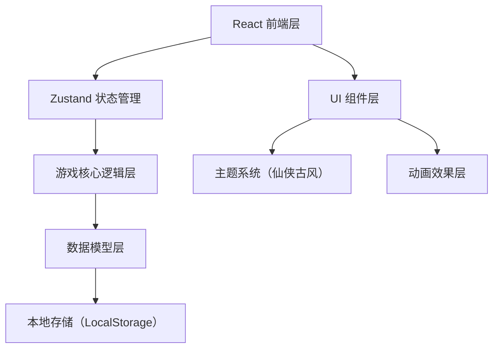
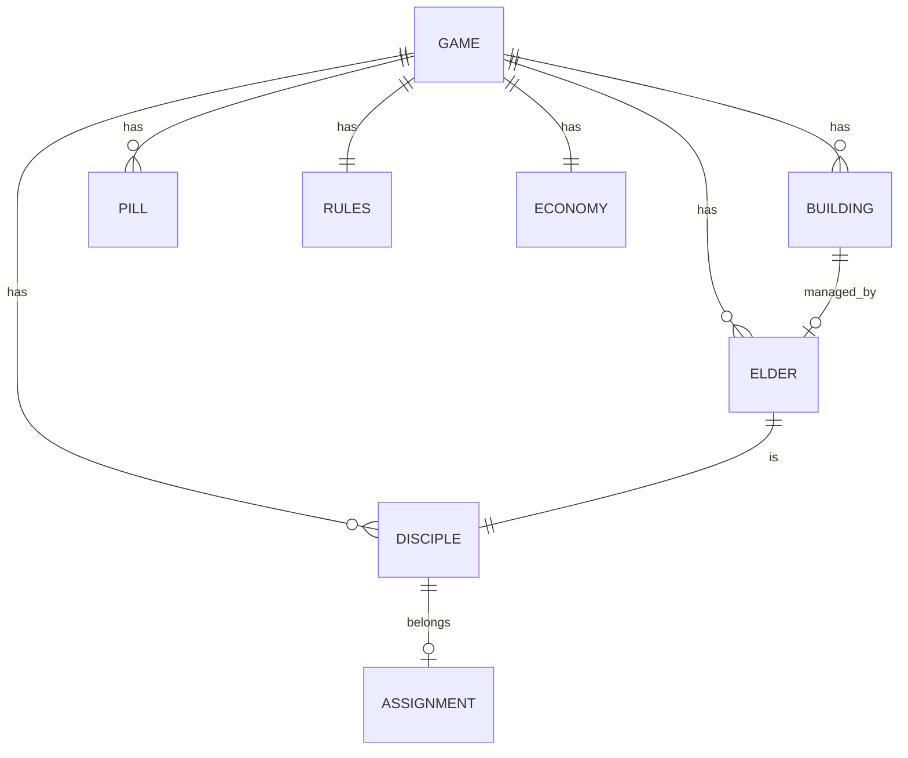

## 1. 架构设计



## 2. 技术选型

- **前端框架**：React@18 + TypeScript@5
- **构建工具**：Vite@5
- **状态管理**：Zustand@4
- **样式方案**：TailwindCSS@3 + CSS Variables
- **路由**：React Router DOM@6（单页面多面板切换）
- **图标**：Lucide React（自定义古风风格化）
- **动画**：Framer Motion（可选，核心动效用CSS）
- **数据持久化**：LocalStorage + Zustand persist 中间件

## 3. 目录结构

```
src/
├── components/          # 可复用组件
│   ├── layout/         # 布局组件（Header/Sidebar/Modal）
│   ├── disciple/       # 弟子相关组件
│   ├── building/       # 建筑相关组件
│   ├── economy/        # 经济相关组件
│   ├── pill/           # 丹药相关组件
│   ├── elder/          # 长老相关组件
│   └── ui/             # 基础UI组件（Button/Card/Progress等）
├── pages/              # 页面级组件
│   ├── MainView.tsx    # 主界面（宗门俯瞰）
│   ├── Disciples.tsx   # 弟子面板
│   ├── Buildings.tsx   # 建筑面板
│   ├── Economy.tsx     # 经济面板
│   ├── Rules.tsx       # 门规面板
│   ├── Pills.tsx       # 丹药面板
│   └── Elders.tsx      # 长老面板
├── store/              # Zustand 状态管理
│   ├── gameStore.ts    # 游戏主状态
│   ├── discipleStore.ts # 弟子状态
│   └── uiStore.ts      # UI状态
├── types/              # TypeScript 类型定义
│   ├── disciple.ts     # 弟子相关类型
│   ├── building.ts     # 建筑相关类型
│   ├── economy.ts      # 经济相关类型
│   ├── pill.ts         # 丹药相关类型
│   └── game.ts         # 游戏全局类型
├── utils/              # 工具函数
│   ├── gameLogic.ts    # 游戏核心逻辑
│   ├── calculations.ts # 计算公式
│   ├── random.ts       # 随机数生成
│   └── storage.ts      # 本地存储
├── data/               # 初始数据/配置
│   ├── initialGame.ts  # 游戏初始状态
│   ├── buildings.ts    # 建筑配置
│   └── pills.ts        # 丹药配置
├── hooks/              # 自定义 Hooks
│   ├── useGameLoop.ts  # 游戏循环 Hook
│   └── useMonthly.ts   # 月度结算 Hook
├── styles/             # 全局样式
│   ├── theme.css       # 主题变量（仙侠古风）
│   └── globals.css     # 全局样式
├── App.tsx             # 应用入口
├── main.tsx            # React 入口
└── index.css           # 样式入口
```

## 4. 数据模型

### 4.1 核心数据模型 ER 图



### 4.2 核心类型定义

```typescript
// 游戏全局状态
interface GameState {
  year: number;
  month: number;
  sectLevel: SectLevel;
  reputation: number;
  spiritStones: number;
  contributionPoints: number;
  disciples: Disciple[];
  buildings: Building[];
  pills: PillInventory[];
  elders: Elder[];
  rules: RulesConfig;
  notifications: Notification[];
  monthlyReport: MonthlyReport | null;
}

// 弟子
interface Disciple {
  id: string;
  name: string;
  age: number;
  lifespan: number;
  status: DiscipleStatus; // 杂役/外门/内门/核心/长老
  realm: Realm; // 境界
  realmProgress: number; // 当前境界进度 0-100
  cultivationSpeed: number;
  hiddenTalents: HiddenTalents; // 根骨/灵韵/命寿/道缘 (隐藏)
  talentDisplay: TalentDisplay; // 天赋外在表现
  contributionPoints: number;
  assignedHall: string | null; // 分配的堂口
  joinDate: { year: number; month: number };
  breakthroughAttempts: number;
  buffs: Buff[];
}

// 建筑
interface Building {
  id: string;
  name: string;
  type: BuildingType;
  level: number;
  maxLevel: number;
  status: BuildingStatus; // 未解锁/正常/维护中/关闭
  baseOutput: { spiritStones?: number; contribution?: number; herbs?: number };
  maintenanceCost: number;
  upgradeCost: { spiritStones: number; reputation: number };
  assignedElderId: string | null;
  discipleSlots: number;
  assignedDisciples: string[];
  unlocked: boolean;
}

// 经济
interface EconomySnapshot {
  spiritStones: number;
  contributionPoints: number;
  monthlyIncome: { source: string; amount: number }[];
  monthlyExpense: { source: string; amount: number }[];
}
```

## 5. 游戏循环设计

### 5.1 月度结算流程

```
每月结算步骤：
1. 计算建筑产出（灵石/贡献点/灵草）
2. 扣除建筑维护费
3. 弟子修炼（增加修为进度）
4. 检查突破（满足条件触发突破判定）
5. 弟子劳作（增加贡献点）
6. 检查自动晋升（按门规条件）
7. 检查随机事件
8. 检查宗门升级条件
9. 生成月度简报
10. 增加月份计数
```

### 5.2 突破判定公式

```
突破成功率 = 基础成功率 + (失败次数 × 失败加成) + 丹药加成 + 天赋加成

突破成功 → 境界提升一阶，进度归零
突破失败 → 修为倒退5%（元婴以上8%），获得"破而后立"buff
```

## 6. 状态管理设计

### 6.1 Store 划分

- **gameStore**: 游戏主状态、时间推进、月度结算
- **discipleStore**: 弟子 CRUD、晋升、分配
- **uiStore**: UI 状态（当前面板、弹窗、动画状态）

### 6.2 持久化

使用 zustand persist 中间件，自动保存到 LocalStorage，key 为 `sect-game-save`。
